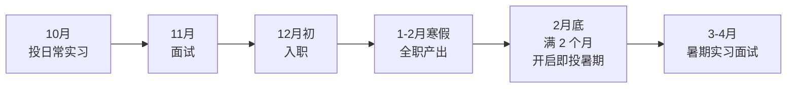
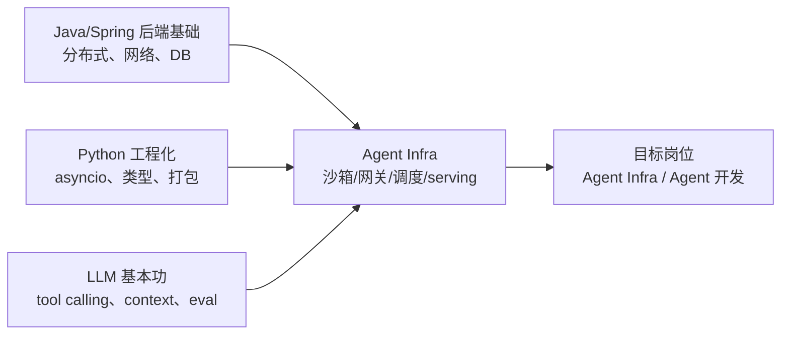

# Agent 方向四个月冲刺规划

> 周期：2026-08-20 → 2026-12-20（延伸至 2027-04 的暑期实习投递）
> 目标：12 月前入职一段日常实习（南京优先），2027 年 2 月底带着这段经历「开启即投」暑期实习
> 起点：Java 后端基础，Python 会写但不熟工程化，未系统接触推理引擎

## 目录

- [三条不能违背的原则](#三条不能违背的原则)
- [两阶段战略：日常实习 → 暑期实习](#两阶段战略日常实习--暑期实习)
- [路线选择：为什么是 agent infra](#路线选择为什么是-agent-infra)
- [能力矩阵与当前差距](#能力矩阵与当前差距)
- [分月计划](#分月计划)
- [每周 checklist](#每周-checklist)
- [日常时间分配](#日常时间分配)
- [投递节奏](#投递节奏)
- [风险与止损](#风险与止损)

## 三条不能违背的原则

1. **一个有数字的深度项目，胜过三个框架 demo。**
   「我用 LangChain 搭了个客服机器人」在面试里换不来一个追问；「我实现的 agent 沙箱执行服务，冷启动 p99 从 1.2s 降到 180ms，单机支撑 200 并发会话」能撑起二十分钟深聊。**所有项目产出必须带 benchmark 数字**，没有数字的项目等于没做。

2. **10 月就要投出日常实习，不要等准备好。**
   日常实习全年滚动、面试通常只有一到两轮、考察深度远低于暑期实习，**用 9 月底的水平就能投**。等项目做完美再投，会直接错过 12 月入职的窗口（原因见下一节的倒推）。第一次面试挂掉不是损失，是免费的能力诊断。

3. **算法不能丢。**
   大厂 agent 岗依然考 LeetCode，手撕代码过不了，前面的项目再漂亮也进不到下一轮。每天 1–2 题是底线，不是可选项。

## 两阶段战略：日常实习 → 暑期实习

**暑期实习才是决胜局**（它直连转正和秋招），日常实习是拿下它的垫脚石。两者的定位完全不同：

| | 日常实习（2026-12 入职） | 暑期实习（2027-06 入职） |
| --- | --- | --- |
| 定位 | 垫脚石：换一段可写的工业界经历 | 决胜局：直连转正 offer 与秋招主动权 |
| 地域 | **南京优先**（要上课，通勤成本必须低） | **杭州主投、全国保底**（正式工作也倾向杭州） |
| 岗位要求 | 放宽：云原生 / 平台 / 后端都算，只要技术含量真实 | 收窄：正面对着 agent infra 岗投 |
| 筛选强度 | 低，一到两轮面试 | 高，两到三轮 + 笔试，接近秋招难度 |
| 投递时间 | 2026 年 10 月起 | 2027 年 2 月底 – 4 月中旬 |

### 为什么日常实习必须 12 月前入职

暑期实习的投递分层规则（业内普遍现象）：**学历中等 + 准备完善 + 有一段日常实习经历的同学可以「开启即投」；没有实习经历的建议 4 月中旬再投以避开简历拥堵。** 而 2 月底那一批的 HC 和捞人意愿远高于 4 月。

一段实习要写得有分量至少需要两个月。倒推：

| 节点 | 时间 | 不做会怎样 |
| --- | --- | --- |
| 投日常实习 | 2026-10 | 11 月才投则 12 月底才入职，2 月底时时长不够 |
| 入职 | 2026-12 初 | 拖到 1 月入职，2 月底只有 1 个多月，写进简历分量不足 |
| 寒假全职 | 2027-01 – 02 | 这是唯一能全职投入的窗口，产出主要靠它 |
| 投暑期实习 | 2027-02 底 | 拖到 4 月中，等于放弃第一批 HC |

**所以「寒假去找实习」这个想法要修正：寒假是你已经在实习、能全职产出的黄金期，不是投简历的时期。**

### 南京的现实与地域策略

南京不是 agent 的核心研发城市，本地能找到的主要是三类：南大计算机学院大模型中心一类的高校资源（有大模型系统优化与智能体方向，但对外校学生基本不开放）、行业大模型落地（运营商、电力、金融、通信）、以及本地 AI 公司的 Agent 平台产品。大厂在南京有研发中心，但 agent 核心团队不在这里。

**日常实习的投递优先级**：

1. 南京本地与 LLM / agent 直接相关的岗位（本地 AI 公司、行业大模型落地团队）
2. 南京本地大厂研发中心的**云原生 / 平台 / 后端**岗 —— 沙箱、调度、可观测性这些能力在普通平台岗里同样能练，对 3 月投 agent infra 是正向背书，**不算浪费**
3. **远程实习**（被严重低估的选项）：AI 创业公司普遍接受远程或每周固定几天，这是在南京拿到「真 agent 经历」的最优路径
4. 苏州（高铁约 1 小时）、上海（约 1.5 小时）：能接受周中在当地住的话，选择面扩大一个量级

**南京要避开的坑**：外包 / 人力外包性质的岗位、以及挂着「AI 应用」实则纯调 API 拼页面的活。面试时问清三件事就能判断——**我的 mentor 是谁？我写的代码进不进主干？团队有没有 GPU 和真实流量？** 三个问题都含糊的，别去。

另外问清**能否在 2 月底结束**——有些日常实习要求六个月且不给转正通道，会直接压掉你投暑期实习的时间。

## 路线选择：为什么是 agent infra

Java 后端底子在 agent infra 这一侧是**优势不是负担**。agent 平台的核心难题——高并发长连接、任务编排、多租户隔离、限流熔断、状态持久化、可观测性——本质就是分布式后端问题，只是被套进了 LLM 的语境。

两侧岗位的差别，投递时要分清：

| 维度 | Agent 应用开发 | Agent Infra（主攻） |
| --- | --- | --- |
| 核心工作 | 框架编排、prompt/context engineering、RAG、eval、产品化 | 沙箱运行时、网关、调度、推理服务、记忆存储、可观测性 |
| 主力语言 | Python / TypeScript | Python / Go / Rust，部分 C++ |
| 加分项 | 产品 sense、评测体系、领域数据 | K8s、性能优化、分布式系统、GPU 与推理引擎 |
| 你的匹配度 | 中（需补产品与数据经验） | 高（后端经验直接复用） |

**必须补的三块短板**：

- Python 异步工程化（agent 生态基本全在 Python/TS，Java 在这里帮不上忙）
- 容器与 K8s（沙箱隔离和服务部署完全躲不开）
- LLM 推理侧原理（KV cache、continuous batching、量化，面试必问）

## 能力矩阵与当前差距

自评打分（0 = 没碰过，5 = 能独立设计并讲清权衡），每月末重评一次，填在 [weekly-review.md](weekly-review.md)。

| 能力项 | 8/20 起点 | 12/20 目标 |
| --- | --- | --- |
| Java / Spring / 分布式后端 | 3 | 4（保持并复用到系统设计） |
| Python 异步工程化 | 1 | 4 |
| LLM API 与 tool calling | 1 | 4 |
| Agent 架构与 context engineering | 0 | 4 |
| Docker / K8s / 沙箱隔离 | 1 | 3.5 |
| 推理引擎（vLLM / SGLang） | 0 | 3 |
| Eval 与 benchmark 设计 | 0 | 3.5 |
| 可观测性（OTel / trace） | 1 | 3 |
| 算法（LeetCode） | 2 | 4 |

## 分月计划

### 第 1 月（8/20 – 9/20）：手写 agent loop，把黑盒拆开

**主线：不用任何框架，从零写一个 agent 循环。**

直接调 OpenAI / Anthropic 兼容 API，自己实现：tool schema 生成、function calling 解析、多轮 context 拼装、流式输出、token 预算裁剪、错误重试与降级。写完之后再去读 LangGraph / Claude Agent SDK 的源码，逐点对比自己的设计差在哪。

这一步决定你面试时能不能讲清「agent 到底是什么」。大部分候选人讲不清，因为他们只用过框架。

**补 Python 工程化**：`asyncio`、`pydantic`、`uv`、`pytest`、类型标注。最后用 FastAPI 把 agent loop 包成流式 SSE 服务，前端随便一个页面能看到逐字输出。

**读透而非泛读**（每篇输出一篇博客到 `blog/`）：

- ReAct 论文
- Anthropic《Building effective agents》
- MCP 协议规范（重点看 transport 与 tool 定义部分）
- Cursor / Devin / Claude Code 的公开架构分享

**算法**：LeetCode hot100 起步，每天 2 题，题解记进 `leetcode/`。

**同时启动**：简历初版、加内推群、整理目标公司与 JD 列表。

**月末交付物**：
- [ ] `projects/mini-agent/`：可运行的手写 agent，支持至少 3 个工具、流式输出、上下文裁剪
- [ ] 4 篇技术博客
- [ ] 简历 v1
- [ ] LeetCode 50 道精选新题 + 约 20 次复刷

### 第 2 月（9/20 – 10/20）：项目一 —— Agent 执行沙箱服务

最能体现后端功底、同时是 agent infra 真实痛点的题目。目标：一个能安全运行 LLM 生成代码的多租户执行服务。详细设计见 [projects/README.md](../projects/README.md)。

- Docker 隔离（进阶 gVisor / Firecracker），容器池预热解决冷启动
- 资源配额：CPU、内存、执行超时、网络出口白名单
- 文件系统快照与会话复用，支持多轮增量执行
- 对上暴露 MCP server 接口，任意 agent 客户端可接入
- 对下用 K8s 部署，做水平扩容与优雅下线
- OpenTelemetry 埋点 + trace 面板，能看到每次 tool call 的耗时、token、失败原因

**必须产出的数字**：冷启动 p50/p99、单机并发会话数、逃逸测试结果、每千次调用成本。

**投递（本月最重要的事，优先级高于项目进度）**：10 月初开始正式批量投**日常实习**，每周 5–8 家，南京本地优先、放宽岗位定义、同时投远程。记录进 [weekly-review.md](weekly-review.md) 的投递追踪表。

沙箱项目此时是半成品，**这不影响投递**——日常实习的筛选强度低，mini-agent + 沙箱雏形足够撑起面试。等项目完美再投会错过 12 月入职的窗口。

**月末交付物**：
- [ ] 沙箱服务可部署、可压测，有 README 架构图
- [ ] 压测报告（含数字）
- [ ] 简历 v2（沙箱项目 STAR 化）
- [ ] 累计投递 ≥ 25 家，**已进入面试流程 ≥ 3 家**

### 第 3 月（10/20 – 11/20）：拿下日常实习 offer，项目二并行

**本月第一优先级是拿到日常实习 offer 并谈定 12 月初入职。** 项目二是并行的第二优先级，**进度冲突时砍项目，不砍面试**。

**面试**：日常实习面试通常一到两轮，重点是项目深挖和手撕。每次面试的问题原文当天记进 [interview.md](interview.md)。谈 offer 时务必问清：mentor 是谁、代码进不进主干、有没有 GPU 和真实流量、**能否在 2 月底结束**。

**推理服务**：用 vLLM 或 SGLang 部署一个开源模型，压测出 throughput / TTFT / TPOT 曲线；调 batch size、KV cache 利用率、prefix caching；做一次量化（AWQ 或 GPTQ）并对比精度损失。搞懂 PagedAttention 与 continuous batching 的原理，要能在白板上画出来。

**eval harness**：给项目一接一套 agent 评测，跑 SWE-bench Lite 子集或自建任务集，报告成功率、平均步数、平均成本、失败归因分布。**会做 eval 的候选人极其稀缺**，这是最容易建立差异化的点。

**开源 PR**：目标 2–3 个被 merge 的 PR。从文档修正、测试补全、小 bug 修起（vLLM、SGLang、dify、MCP 官方 SDK 对新人相对友好）。简历里一条 merged PR 链接的说服力，常常超过一个自研项目。

**可以砍的部分**：如果面试占满时间，项目二退化为「vLLM 部署跑通 + 一条吞吐延迟曲线 + 能讲清 PagedAttention 与 continuous batching 原理」，量化实验和完整 eval 挪到寒假。**能讲清原理 + 有一条实测曲线，已经够应付日常实习面试。**

**月末交付物**：
- [ ] **日常实习 offer，已确认 12 月初入职**（本月唯一的硬指标）
- [ ] 推理压测报告（至少一条吞吐/延迟曲线）
- [ ] eval harness 骨架
- [ ] ≥ 1 个 merged PR
- [ ] LeetCode 累计约 130 道新题 + 50 次复刷/模拟

### 第 4 月（11/20 – 12/20）：入职实习，节奏切换

12 月初入职后，每周被工作占掉三到五天，**自学时间锐减到原来的三分之一**。必须主动做减法，不要三条线同时推。

**优先级排序**（时间不够就从下往上砍）：

1. **把实习做出成果。** 这是 3 月投暑期实习时简历上最新、最有分量的一段，比任何自研项目都重要。第一个月摸清业务、拿到能写进简历的活。
2. **算法不断。** 降到每天 1 题，通勤路上背错题本。
3. **八股整理**：Transformer / attention、KV cache、RAG 全链路、agent 设计模式、tool calling 可靠性、幻觉治理。利用晚上碎片时间往 `notes/topics/` 里累积，不求成体系。
4. 项目二的收尾工作，能推多少推多少。

**实习期间的额外收获**：真实的线上系统、真实的故障、真实的代码评审标准。**主动记录你在实习中接触到的架构与踩过的坑**，这些是暑期实习面试里最鲜活的素材。

**月末交付物**：
- [ ] 实习顺利入职并度过适应期，明确了自己负责的模块
- [ ] 简历 v3（加上实习经历那一段）
- [ ] 八股笔记覆盖 ≥ 80 题
- [ ] LeetCode 累计约 150 道新题 + 70 次复刷/模拟

### 延伸期（2027-01 – 04）：寒假全职产出，2 月底投暑期实习

四个月计划的终点不是终点，真正的目标在这里。**这段时间的安排现在就要知道，否则 12 月会做错取舍。**

| 时间 | 主线 |
| --- | --- |
| 2027-01 – 02 | **寒假全职实习**，这是唯一能全力投入的窗口，争取做出一个可量化的产出。晚上和周末补完项目二的量化实验与完整 eval |
| 2027-02 中 | 简历终版：实习经历 + 三个项目 + 开源 PR，按 agent infra / 应用两个方向各出一版；mock 面试 ×5 |
| 2027-02 底 | **暑期实习开投**。字节、腾讯、美团、阿里等通常在 2 月 20 日 – 3 月 10 日陆续开放，有实习经历就「开启即投」，不要拖到 4 月 |
| 2027-03 – 04 | 密集面试期。系统设计专项在这时集中练，日常实习的经历是最好的谈资 |
| 2027-06 起 | 暑期实习入职，目标转正 offer |

**这一阶段的地域策略要反转**：暑期实习以杭州为主战场，因为正式工作也倾向杭州；但不要设成「只投杭州」。暑期实习的首要价值是转正，建议按 **杭州 60% / 上海 15% / 北京 15% / 深圳及其他 10%** 分配投递。异地拿到明显更好的团队也先去实习，秋招时再回杭州投正式岗。

### 杭州主战场怎么投

杭州的优势不只是岗位数量，而是有一条完整链路：大模型与云平台、Agent 应用、金融科技、电商与本地生活场景都集中。按匹配度排序：

1. **阿里云 / 通义 / 百炼**：模型服务、Agent 平台、推理与云原生基础设施，最贴合 agent infra 主线
2. **蚂蚁集团**：百灵大模型、金融 Agent、RAG 与平台工程，应用和 infra 都有机会
3. **阿里业务团队**：高德、钉钉、淘宝天猫、1688、盒马等都有 Agent 落地；其中高德公开岗位明确同时要求 Java 后端与 Agent 开发，和你的背景很匹配
4. **网易及杭州 AI / 云计算公司**：作为第二梯队，重点筛平台工程、推理服务、Agent 后端，而不是纯 prompt 岗
5. **海康威视、大华、新华三等本地技术公司**：偏端侧 AI、云平台和行业智能，作为 infra / 后端保底，不强求岗位标题带 Agent

投递比例只是防止搜索偏科，不是硬性配额。**同一家公司按团队质量排序，不按品牌排序**：有真实流量、代码进主干、有明确 mentor 的业务 Agent 团队，可能比核心模型部门外围的工具岗更值得去。

## 每周 checklist

每周日晚上花 30 分钟勾选并写复盘。**连续两周某项没勾上，就要在复盘里写清原因和调整方案。**

### 第 1 月

- [x] **W1（8/20–8/26）** 环境搭好（`uv` + Python 3.12 + DeepSeek API）；跑通最小 chat completion；手写第一个 tool calling 循环（含错误回传）。LeetCode 哈希 6 题，未满 14 题次，差额挪到 W2
- [ ] **W2（8/27–9/2）** mini-agent 支持多工具与工具错误重试；读 ReAct + Building effective agents 并各写一篇博客；LeetCode 双指针 14 题次
- [ ] **W3（9/3–9/9）** 加流式输出与 token 预算裁剪；FastAPI + SSE 包装成服务；`pytest` 补测试；LeetCode 滑动窗口与前缀和 14 题次
- [ ] **W4（9/10–9/16）** 读 MCP 规范并把 mini-agent 的工具改造成 MCP server；读 LangGraph 源码写对比博客；简历 v1；LeetCode 链表 14 题次
- [ ] **W5（9/17–9/23）** mini-agent 收尾并写 README 架构图；**整理南京 + 远程的目标公司 JD 表**；简历 v1 定稿；LeetCode 栈与队列 14 题次

### 第 2 月（投递月）

- [ ] **W6（9/24–9/30）** 沙箱项目开工：Docker SDK 起容器执行代码，打通最朴素版本；确定资源配额方案；LeetCode 二分查找 14 题次
- [ ] **W7（10/1–10/7）** 容器池预热 + 冷启动优化，测出优化前后数字；**日常实习正式开投，本周 ≥ 8 家（南京优先 + 远程）**
- [ ] **W8（10/8–10/14）** 文件系统快照与会话复用；网络出口白名单；写基础安全测试；投递 ≥ 6 家；LeetCode 二叉树进阶 14 题次
- [ ] **W9（10/15–10/21）** 暴露 MCP server 接口并接上 mini-agent；K8s 部署；OTel 埋点；压测出完整报告；简历 v2；**处理面试邀约**
- [ ] 月度自评能力矩阵，更新到 weekly-review

### 第 3 月（面试月，面试优先于项目）

- [ ] **W10（10/22–10/28）** vLLM 部署跑通；理解 PagedAttention 与 continuous batching 并写一篇原理博客；投递补量 ≥ 6 家；面试复盘当天回填
- [ ] **W11（10/29–11/4）** 推理压测：throughput / TTFT / TPOT 曲线；面试进行中；LeetCode 堆与区间 14 题次
- [ ] **W12（11/5–11/11）** 量化实验（AWQ/GPTQ）+ 精度对比；找开源 issue 提第一个 PR；**争取 offer 到手**
- [ ] **W13（11/12–11/18）** eval harness 骨架：任务集、执行器、指标计算；**确认 offer 与 12 月初入职时间**
- [ ] **W14（11/19–11/25）** 入职前收尾：沙箱项目文档补齐、简历 v3 加实习那一段的占位；月度自评

### 第 4 月（实习月，节奏切换）

- [ ] **W15（11/26–12/2）** 入职准备；八股整理第一轮（Transformer / KV cache）；LeetCode 降至每天 1 题
- [ ] **W16（12/3–12/9）** **实习入职**，摸清业务与代码库；晚上继续八股（RAG 全链路）
- [ ] **W17（12/10–12/16）** 实习中拿到明确负责的模块；八股第三轮（agent 设计模式 / tool calling 可靠性）
- [ ] **W18（12/17–12/20）** 阶段收口：把四个月产出写成一篇总结博客（也是暑期实习自我介绍的素材）；规划寒假全职期的产出目标

## 日常时间分配

工作日每天 5–6 小时投入（研二有课的话按比例压缩，但**算法和项目两条线不能同时断**）：

| 时段 | 内容 | 时长 |
| --- | --- | --- |
| 早 | LeetCode 2 题次（新题或复刷，按周模块） | 1h |
| 中 | 当月主线项目开发 | 3h |
| 晚 | 读论文/源码 或 八股整理 | 1h |
| 睡前 | 刷 JD、投递、回消息 | 0.5h |

周末：一天补项目进度或写博客，一天休息。**不要不休息，四个月是马拉松。**

## 投递节奏

| 阶段 | 时间 | 动作 |
| --- | --- | --- |
| 预热 | 9 月中下旬 | 简历 v1 完成，整理南京 + 远程的 JD 表，零星投 3–5 家练面试手感 |
| 起量 | 10 月初 – 11 月中 | **日常实习每周 5–8 家**，南京优先、放宽岗位定义、同时投远程，优先内推 |
| 收口 | 11 月中 – 11 月底 | 谈定 offer 与 12 月初入职时间；两周无响应的一律记为默认挂 |
| 实习期 | 12 月 – 2027 年 2 月 | 停止日常实习投递，专注做出成果 |
| 暑期实习 | 2027 年 2 月底 – 4 月中 | **杭州主投、全国保底**，正面投 agent infra 岗，有实习经历就开启即投 |

**日常实习的目标清单**（南京优先，具体名单和进度维护在 weekly-review 的投递追踪表）：

- 南京本地 LLM / agent 相关：本地 AI 公司、行业大模型落地团队（运营商、电力、金融、通信方向）
- 南京本地大厂研发中心的云原生 / 平台 / 后端岗 —— **放宽岗位定义，这不算浪费**
- **远程实习**：agent 方向创业公司普遍接受远程，这是在南京拿到真 agent 经历的最优路径
- 苏州 / 上海：高铁 1–1.5 小时，能接受周中在当地住则选择面大一个量级

**暑期实习的目标清单**（2027 年 2 月底启用，杭州主投但不唯一）：

- 杭州第一梯队：阿里云 / 通义 / 百炼、蚂蚁百灵及 Agent 平台团队
- 杭州第二梯队：高德、钉钉、淘宝天猫、1688 等业务 Agent 团队，网易及杭州 AI / 云计算公司
- 杭州保底：海康威视、大华、新华三等公司的 AI 平台 / 云原生 / 后端岗位
- 全国补充：字节（Seed / 扣子）、腾讯混元、Moonshot、智谱、MiniMax、DeepSeek、面壁、阶跃、美团、快手、小红书、B 站
- 兜底与练手：agent 方向的早期创业公司（给的活往往更硬核，也更容易进）

**内推优先级高于官网投递**。学历权重主要作用在简历初筛这一关，走内推进去之后基本就是项目和面试说话。实验室师兄师姐、开源社区里聊过的人、技术群里的 HR，都要用上。

## 风险与止损

- **别在框架上花太多时间。** LangChain / Dify 这类工具三天能上手，面试不加分。时间应该花在原理和自己动手实现上。
- **四个月做不完两个「完美」项目。** 优先把项目一做到有真实数字和压测报告；项目二可以退化成「能讲清原理 + 有压测曲线」的深度学习成果，不必是完整系统。
- **GPU 资源可能是瓶颈。** 第 3 月的推理实验如果拿不到卡，退路是租按小时计费的云 GPU 跑关键实验，或用小模型（0.5B–7B）在单卡/CPU 上验证原理并诚实标注实验规模。
- **竞争对手里有大量已发论文的同学。** 你的差异化不是模型能力，而是「能把 agent 系统跑稳、跑快、跑省钱」的工程能力。所有精力都该往这个叙事上收敛，不要临时去卷论文。
- **南京的岗位质量参差。** 警惕外包 / 人力外包性质的岗位，以及挂着「AI 应用」实则纯调 API 拼页面的活。面试时问清：mentor 是谁、代码进不进主干、有没有 GPU 和真实流量。三个问题都含糊的不去——**去了等于浪费掉唯一的一段实习经历**。
- **别签会压掉暑期实习的日常实习。** 有些岗位要求六个月以上且没有转正通道，入职前必须确认能在 2027 年 2 月底结束。
- **入职后自学时间会锐减到三分之一。** 12 月开始必须做减法，按第 4 月的优先级排序砍，不要三条线同时推。
- **如果 11 月中还没有任何面试**：立刻停下学习，把两周时间全部投入简历重写 + 大规模内推 + 进一步放宽岗位与地域（包括接受纯后端岗、接受远程无薪）。没有面试通常是简历叙事问题，不是能力问题。**这条止损比原计划提前了两周，因为 12 月初入职是硬约束。**
- **如果 12 月还是没有日常实习**：不要硬等。把 1–2 月的寒假全部投入项目二的完整版和开源 PR，用三个有数字的项目 + merged PR 去补偿没有实习经历的劣势，暑期实习投递时间推迟到 3 月中—4 月初那一批。
