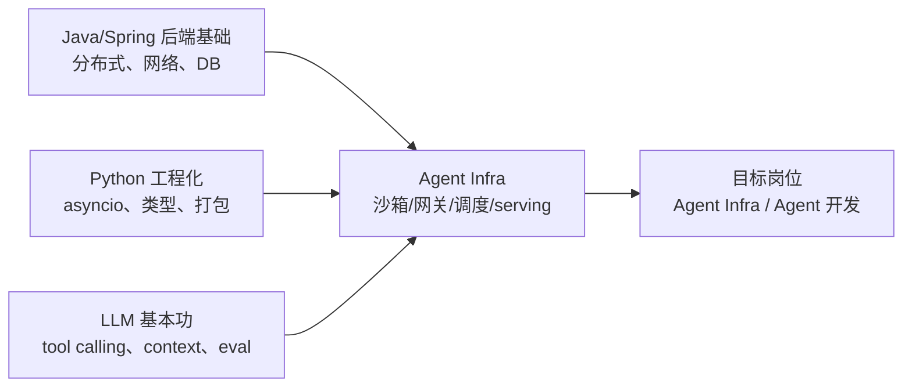

# Agent 方向四个月冲刺规划

> 周期：2026-08-20 → 2026-12-20
> 目标：拿到 agent infra / agent 开发方向的寒假实习 offer
> 起点：Java 后端基础，Python 会写但不熟工程化，未系统接触推理引擎

## 目录

- [三条不能违背的原则](#三条不能违背的原则)
- [路线选择：为什么是 agent infra](#路线选择为什么是-agent-infra)
- [能力矩阵与当前差距](#能力矩阵与当前差距)
- [分月计划](#分月计划)
- [每周 checklist](#每周-checklist)
- [日常时间分配](#日常时间分配)
- [投递节奏](#投递节奏)
- [风险与止损](#风险与止损)

## 三条不能违背的原则

1. **一个有数字的深度项目，胜过三个框架 demo。**
   「我用 LangChain 搭了个客服机器人」在面试里换不来一个追问；「我实现的 agent 沙箱执行服务，冷启动 p99 从 1.2s 降到 180ms，单机支撑 200 并发会话」能撑起二十分钟深聊。**所有项目产出必须带 benchmark 数字**，没有数字的项目等于没做。

2. **9 月中就开始投，不要等准备好。**
   国内日常实习 / 寒假实习是滚动招聘，agent 团队多是需求驱动、来了就捞。边投边补、用面试反馈反向指导学习，效率远高于闷头学四个月再投。第一次面试挂掉不是损失，是免费的能力诊断。

3. **算法不能丢。**
   大厂 agent 岗依然考 LeetCode，手撕代码过不了，前面的项目再漂亮也进不到下一轮。每天 1–2 题是底线，不是可选项。

## 路线选择：为什么是 agent infra

Java 后端底子在 agent infra 这一侧是**优势不是负担**。agent 平台的核心难题——高并发长连接、任务编排、多租户隔离、限流熔断、状态持久化、可观测性——本质就是分布式后端问题，只是被套进了 LLM 的语境。

两侧岗位的差别，投递时要分清：

| 维度 | Agent 应用开发 | Agent Infra（主攻） |
| --- | --- | --- |
| 核心工作 | 框架编排、prompt/context engineering、RAG、eval、产品化 | 沙箱运行时、网关、调度、推理服务、记忆存储、可观测性 |
| 主力语言 | Python / TypeScript | Python / Go / Rust，部分 C++ |
| 加分项 | 产品 sense、评测体系、领域数据 | K8s、性能优化、分布式系统、GPU 与推理引擎 |
| 你的匹配度 | 中（需补产品与数据经验） | 高（后端经验直接复用） |

**必须补的三块短板**：

- Python 异步工程化（agent 生态基本全在 Python/TS，Java 在这里帮不上忙）
- 容器与 K8s（沙箱隔离和服务部署完全躲不开）
- LLM 推理侧原理（KV cache、continuous batching、量化，面试必问）

## 能力矩阵与当前差距

自评打分（0 = 没碰过，5 = 能独立设计并讲清权衡），每月末重评一次，填在 [weekly-review.md](weekly-review.md)。

| 能力项 | 8/20 起点 | 12/20 目标 |
| --- | --- | --- |
| Java / Spring / 分布式后端 | 3 | 4（保持并复用到系统设计） |
| Python 异步工程化 | 1 | 4 |
| LLM API 与 tool calling | 1 | 4 |
| Agent 架构与 context engineering | 0 | 4 |
| Docker / K8s / 沙箱隔离 | 1 | 3.5 |
| 推理引擎（vLLM / SGLang） | 0 | 3 |
| Eval 与 benchmark 设计 | 0 | 3.5 |
| 可观测性（OTel / trace） | 1 | 3 |
| 算法（LeetCode） | 2 | 4 |

## 分月计划

### 第 1 月（8/20 – 9/20）：手写 agent loop，把黑盒拆开

**主线：不用任何框架，从零写一个 agent 循环。**

直接调 OpenAI / Anthropic 兼容 API，自己实现：tool schema 生成、function calling 解析、多轮 context 拼装、流式输出、token 预算裁剪、错误重试与降级。写完之后再去读 LangGraph / Claude Agent SDK 的源码，逐点对比自己的设计差在哪。

这一步决定你面试时能不能讲清「agent 到底是什么」。大部分候选人讲不清，因为他们只用过框架。

**补 Python 工程化**：`asyncio`、`pydantic`、`uv`、`pytest`、类型标注。最后用 FastAPI 把 agent loop 包成流式 SSE 服务，前端随便一个页面能看到逐字输出。

**读透而非泛读**（每篇输出一篇博客到 `blog/`）：

- ReAct 论文
- Anthropic《Building effective agents》
- MCP 协议规范（重点看 transport 与 tool 定义部分）
- Cursor / Devin / Claude Code 的公开架构分享

**算法**：LeetCode hot100 起步，每天 2 题，题解记进 `leetcode/`。

**同时启动**：简历初版、加内推群、整理目标公司与 JD 列表。

**月末交付物**：
- [ ] `projects/mini-agent/`：可运行的手写 agent，支持至少 3 个工具、流式输出、上下文裁剪
- [ ] 4 篇技术博客
- [ ] 简历 v1
- [ ] LeetCode 60 题

### 第 2 月（9/20 – 10/20）：项目一 —— Agent 执行沙箱服务

最能体现后端功底、同时是 agent infra 真实痛点的题目。目标：一个能安全运行 LLM 生成代码的多租户执行服务。详细设计见 [projects/README.md](../projects/README.md)。

- Docker 隔离（进阶 gVisor / Firecracker），容器池预热解决冷启动
- 资源配额：CPU、内存、执行超时、网络出口白名单
- 文件系统快照与会话复用，支持多轮增量执行
- 对上暴露 MCP server 接口，任意 agent 客户端可接入
- 对下用 K8s 部署，做水平扩容与优雅下线
- OpenTelemetry 埋点 + trace 面板，能看到每次 tool call 的耗时、token、失败原因

**必须产出的数字**：冷启动 p50/p99、单机并发会话数、逃逸测试结果、每千次调用成本。

**投递**：10 月初开始正式大批量投递，每周固定 5–8 家，记录进 [weekly-review.md](weekly-review.md) 的投递追踪表。

**月末交付物**：
- [ ] 沙箱服务可部署、可压测，有 README 架构图
- [ ] 压测报告（含数字）
- [ ] 简历 v2（沙箱项目 STAR 化）
- [ ] 累计投递 ≥ 25 家

### 第 3 月（10/20 – 11/20）：项目二 —— 推理侧 + eval，打通技术栈

**推理服务**：用 vLLM 或 SGLang 部署一个开源模型，压测出 throughput / TTFT / TPOT 曲线；调 batch size、KV cache 利用率、prefix caching；做一次量化（AWQ 或 GPTQ）并对比精度损失。搞懂 PagedAttention 与 continuous batching 的原理，要能在白板上画出来。

**eval harness**：给项目一接一套 agent 评测，跑 SWE-bench Lite 子集或自建任务集，报告成功率、平均步数、平均成本、失败归因分布。**会做 eval 的候选人极其稀缺**，这是最容易建立差异化的点。

**开源 PR**：目标 2–3 个被 merge 的 PR。从文档修正、测试补全、小 bug 修起（vLLM、SGLang、dify、MCP 官方 SDK 对新人相对友好）。简历里一条 merged PR 链接的说服力，常常超过一个自研项目。

**面试**：此时应已进入面试流程，每次面试的问题原文当天记进 [interview.md](interview.md)。

**月末交付物**：
- [ ] 推理压测报告（吞吐/延迟曲线 + 量化对比）
- [ ] eval harness + 一份评测报告
- [ ] ≥ 2 个 merged PR
- [ ] LeetCode 累计 200 题

### 第 4 月（11/20 – 12/20）：转入面试模式，收口

**八股系统化**：Transformer / attention、KV cache、RAG 全链路（chunking、embedding、rerank、评估）、agent 设计模式（planning、reflection、multi-agent、context engineering）、tool calling 可靠性、幻觉治理。

**系统设计专项**：练「设计一个支持万级并发的 agent 平台」这类题，覆盖网关、会话状态存储、长任务 checkpoint 与恢复、成本控制、灰度与回滚。你的 Java 后端经验在这里集中变现。

**简历按 JD 定制**：每个项目用 STAR + 量化数字重写；mock 面试至少 5 场，录音复盘。

12 月是寒假实习发 offer 的密集期，保持投递不停，冷门公司也投——面试机会本身就是练习。

**月末交付物**：
- [ ] 题库覆盖 ≥ 150 题且都能口述
- [ ] 5 场 mock 面试复盘
- [ ] 简历 v3（按目标 JD 定制的 2–3 个版本）
- [ ] 寒假实习 offer

## 每周 checklist

每周日晚上花 30 分钟勾选并写复盘。**连续两周某项没勾上，就要在复盘里写清原因和调整方案。**

### 第 1 月

- [ ] **W1（8/20–8/26）** 环境搭好（`uv` + Python 3.12 + 一个可用的 LLM API key）；跑通最小 chat completion；手写第一个 tool calling 循环；LeetCode 14 题
- [ ] **W2（8/27–9/2）** mini-agent 支持多工具与工具错误重试；读 ReAct + Building effective agents 并各写一篇博客；LeetCode 14 题
- [ ] **W3（9/3–9/9）** 加流式输出与 token 预算裁剪；FastAPI + SSE 包装成服务；`pytest` 补测试；LeetCode 14 题
- [ ] **W4（9/10–9/16）** 读 MCP 规范并把 mini-agent 的工具改造成 MCP server；读 LangGraph 源码写对比博客；简历 v1；LeetCode 14 题
- [ ] **W5（9/17–9/23）** mini-agent 收尾并写 README 架构图；整理目标公司 JD 表；开始零星投递（练面试手感）；LeetCode 14 题

### 第 2 月

- [ ] **W6（9/24–9/30）** 沙箱项目开工：Docker SDK 起容器执行代码，打通最朴素版本；确定资源配额方案；LeetCode 14 题
- [ ] **W7（10/1–10/7）** 容器池预热 + 冷启动优化，测出优化前后数字；**正式开始批量投递，本周 ≥ 8 家**
- [ ] **W8（10/8–10/14）** 文件系统快照与会话复用；网络出口白名单；写基础安全测试；投递 ≥ 6 家；LeetCode 14 题
- [ ] **W9（10/15–10/21）** 暴露 MCP server 接口并接上 mini-agent；K8s 部署；OTel 埋点；压测出完整报告；简历 v2
- [ ] 月度自评能力矩阵，更新到 weekly-review

### 第 3 月

- [ ] **W10（10/22–10/28）** vLLM 部署跑通；理解 PagedAttention 与 continuous batching，写一篇原理博客；投递 ≥ 6 家
- [ ] **W11（10/29–11/4）** 推理压测：throughput / TTFT / TPOT 曲线；调 batch size 与 prefix caching；LeetCode 14 题
- [ ] **W12（11/5–11/11）** 量化实验（AWQ/GPTQ）+ 精度对比；开始找开源 issue，提第一个 PR
- [ ] **W13（11/12–11/18）** eval harness：任务集、执行器、指标计算、失败归因；第二个 PR
- [ ] **W14（11/19–11/25）** 跑完整评测并出报告；把结论反哺回沙箱项目做一轮优化；月度自评

### 第 4 月

- [ ] **W15（11/26–12/2）** 八股整理第一轮（Transformer / KV cache / RAG）；mock 面试 ×1；投递 ≥ 6 家
- [ ] **W16（12/3–12/9）** 八股第二轮（agent 设计模式 / tool calling 可靠性）；系统设计专项 ×3 题；mock ×2
- [ ] **W17（12/10–12/16）** 简历按 JD 定制 2–3 版；mock ×2；集中处理面试邀约
- [ ] **W18（12/17–12/20）** 收口：offer 比较与决策；把四个月产出整理成一篇总结博客

## 日常时间分配

工作日每天 5–6 小时投入（研二有课的话按比例压缩，但**算法和项目两条线不能同时断**）：

| 时段 | 内容 | 时长 |
| --- | --- | --- |
| 早 | LeetCode 2 题 + 复盘昨天错题 | 1h |
| 中 | 当月主线项目开发 | 3h |
| 晚 | 读论文/源码 或 八股整理 | 1h |
| 睡前 | 刷 JD、投递、回消息 | 0.5h |

周末：一天补项目进度或写博客，一天休息。**不要不休息，四个月是马拉松。**

## 投递节奏

| 阶段 | 时间 | 动作 |
| --- | --- | --- |
| 预热 | 9 月中下旬 | 简历 v1 完成，零星投 3–5 家练面试手感，不心疼 |
| 起量 | 10 月初 – 11 月底 | 每周 5–8 家，日常实习 + 寒假实习一起投，优先内推 |
| 收口 | 12 月 | 保持投递，重点跟进已进流程的公司，准备 offer 比较 |

**目标公司分层**（具体名单和进度维护在 weekly-review 的投递追踪表）：

- 第一梯队：字节（Seed / 扣子）、阿里（通义 / 百炼）、腾讯、蚂蚁
- 第二梯队：Moonshot、智谱、MiniMax、DeepSeek、面壁、阶跃
- 第三梯队：美团、快手、小红书、B 站的 agent / 平台团队
- 兜底与练手：agent 方向的早期创业公司（给的活往往更硬核，也更容易进）

**内推优先级高于官网投递**。实验室师兄师姐、开源社区里聊过的人、技术群里的 HR，都要用上。

## 风险与止损

- **别在框架上花太多时间。** LangChain / Dify 这类工具三天能上手，面试不加分。时间应该花在原理和自己动手实现上。
- **四个月做不完两个「完美」项目。** 优先把项目一做到有真实数字和压测报告；项目二可以退化成「能讲清原理 + 有压测曲线」的深度学习成果，不必是完整系统。
- **GPU 资源可能是瓶颈。** 第 3 月的推理实验如果拿不到卡，退路是租按小时计费的云 GPU 跑关键实验，或用小模型（0.5B–7B）在单卡/CPU 上验证原理并诚实标注实验规模。
- **研二寒假实习的竞争对手里有大量已发论文的同学。** 你的差异化不是模型能力，而是「能把 agent 系统跑稳、跑快、跑省钱」的工程能力。所有精力都该往这个叙事上收敛，不要临时去卷论文。
- **如果 11 月底还没有任何面试**：立刻停下学习，把三周时间全部投入简历重写 + 大规模内推 + 降低目标公司门槛。没有面试通常是简历叙事问题，不是能力问题。
