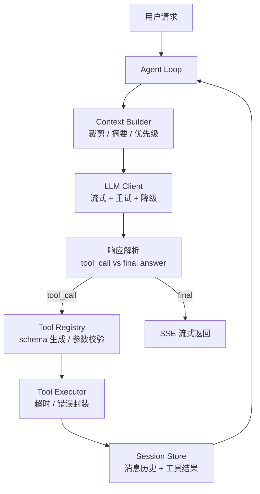
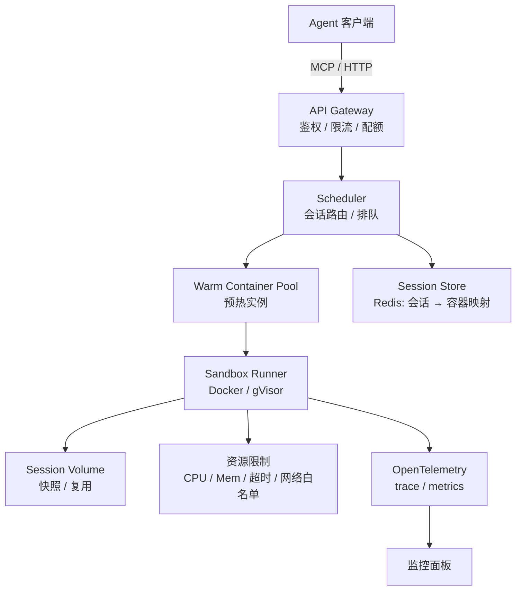
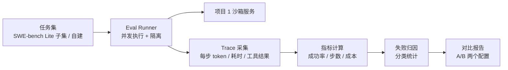

# 项目设计文档

四个月要做三个项目，重要性递减但顺序不能换：项目 0 建立认知，项目 1 是简历主力，项目 2 补齐推理与评测这块面试必问的短板。

| 项目 | 周期 | 定位 | 简历权重 |
| --- | --- | --- | --- |
| [项目 0：mini-agent](#项目-0mini-agent从零手写-agent-循环) | 8/20 – 9/20 | 建立认知，面试时讲原理的底气 | 中 |
| [项目 1：agent 执行沙箱服务](#项目-1agent-执行沙箱服务) | 9/20 – 10/20 | 主力项目，面试深聊的主战场 | 高 |
| [项目 2：推理压测 + eval harness](#项目-2推理压测--eval-harness) | 10/20 – 11/20 | 补推理与评测短板，差异化点 | 中高 |

**贯穿所有项目的一条铁律**：每个项目的 README 必须有一张架构图和一张数字表。没有数字的项目在面试里等于不存在。

---

## 项目 0：mini-agent（从零手写 agent 循环）

### 目标

不依赖任何 agent 框架，实现一个能稳定完成多步任务的 agent，理解每一个环节到底在做什么。**做完这个项目，你要能在白板上把 agent 的一次完整执行画出来，并说清每一步的失败模式。**

### 架构

### 必须自己实现的部分

1. **Tool schema 自动生成**：从 Python 函数签名和 docstring 生成 JSON Schema（用 `pydantic` + `inspect`），不要手写 schema。
2. **Tool calling 解析与容错**：模型返回的参数经常不合法——缺字段、类型错、幻觉出不存在的工具名。每一种都要有明确处理路径（返回结构化错误让模型自己纠正，而不是抛异常终止）。
3. **Context 管理**：消息历史超出 token 预算时怎么裁。至少实现两种策略并对比效果：滑窗丢弃、旧轮次摘要压缩。这是 context engineering 的入门，面试高频。
4. **流式输出**：SSE 逐 token 推送，工具调用过程也要有事件推送（`tool_start` / `tool_end`），前端能看到 agent 在干什么。
5. **重试与降级**：限流退避、超时、主模型不可用时切备用模型。
6. **循环终止条件**：最大步数、重复动作检测、无进展检测。**agent 死循环烧钱是真实事故**，要能讲清你怎么防。

### 至少 3 个工具

- 文件读写（限定在工作目录内，顺便体会一下路径逃逸问题）
- HTTP 请求 / 搜索
- Python 代码执行（先用 `subprocess` 起步，这就是项目 1 的动机来源）

### 技术选型

Python 3.12 + `uv` + `pydantic` + `httpx`（异步）+ FastAPI + `pytest`。**不装 LangChain。**

### 交付标准

- [ ] 能完成一个需要 5+ 步工具调用的复合任务（例如「查资料 → 写脚本 → 执行 → 根据报错修 → 输出结果」）
- [ ] `pytest` 覆盖工具解析容错与 context 裁剪逻辑
- [ ] README 含上面这张架构图 + 一个完整执行 trace 示例
- [ ] 一篇博客：对比自己的设计与 LangGraph / Claude Agent SDK 的差异

### 面试能讲什么

- agent loop 的本质与各环节失败模式
- context 裁剪策略的权衡（丢信息 vs 摘要成本 vs 延迟）
- 为什么需要沙箱（自然过渡到项目 1）

---

## 项目 1：Agent 执行沙箱服务

### 为什么选这个题

LLM 生成的代码必须在隔离环境里跑，这是所有 code agent 产品（Cursor、Devin、E2B、各家 code interpreter）的必备组件。这个题目：

- 是 agent infra 的**真实生产痛点**，不是玩具
- 核心难点（隔离、冷启动、资源配额、多租户、水平扩容）全是**后端能力**，你的 Java 经验直接复用
- 天然有一堆可优化的数字，容易做出 before/after 对比

### 目标

一个多租户代码执行服务：接收代码，在隔离环境中执行，返回 stdout/stderr/文件产物，支持同一会话多轮增量执行。

### 架构

### 分周实施路径

| 周 | 任务 | 产出 |
| --- | --- | --- |
| W6 | Docker SDK 起容器执行代码，最朴素版本打通；确定配额方案 | 能跑，冷启动很慢（这就是你的 baseline 数字） |
| W7 | 容器池预热 + 复用，冷启动优化 | before/after 冷启动 p50/p99 对比 |
| W8 | 会话卷与文件系统快照；网络出口白名单；基础安全测试 | 多轮增量执行可用 + 安全测试报告 |
| W9 | MCP server 接口、K8s 部署、OTel 埋点、完整压测 | 压测报告 + 架构图 + README |

### 关键技术点（面试会往这里挖）

**隔离层次**：先用 Docker（namespace + cgroup），讲清它的隔离边界在哪、为什么共享内核有风险；进阶试 gVisor（用户态内核，syscall 拦截）或 Firecracker（microVM）。**能说清三者的隔离强度与冷启动开销的权衡，就已经超过大部分候选人。**

**冷启动优化**（这是本项目最有价值的数字）：
- 容器池预热：维持 N 个 warm 实例，请求直接绑定
- 池容量的动态伸缩策略（按历史 QPS 预测 vs 固定水位）
- 镜像分层与体积裁剪
- 复用已有容器 vs 每次新建的安全权衡（**必须讲清你怎么在复用时清理残留状态**）

**资源配额**：CPU quota、内存 limit（含 OOM 处理）、执行墙钟超时、磁盘配额、进程数限制（防 fork bomb）、网络出口白名单（防数据外泄和挖矿）。

**多租户**：租户级配额与优先级、防止单租户打满集群、会话亲和性路由。

**故障处理**：容器泄漏回收（孤儿容器定时清理）、节点下线时的会话迁移、执行中断与超时后的清理保证。

### 必须测出来的数字

这张表在项目做完时必须填满，直接搬进简历：

| 指标 | baseline | 优化后 | 备注 |
| --- | --- | --- | --- |
| 冷启动 p50 | | | 从请求到代码开始执行 |
| 冷启动 p99 | | | |
| 单机并发会话数 | | | 在 p99 < X ms 的约束下 |
| 吞吐（次/秒） | | | 简单脚本执行 |
| 内存占用/会话 | | | |
| 每千次调用成本 | | | 按云主机单价折算 |
| 容器逃逸测试 | | | 至少测：路径逃逸、fork bomb、内存炸弹、外网访问、privileged 尝试 |
| 孤儿容器回收率 | | | 混沌测试后残留容器数 |

### 交付标准

- [ ] `docker-compose` 一键起本地版；K8s manifest 可部署集群版
- [ ] MCP server 接口，能被项目 0 的 mini-agent 直接调用
- [ ] 压测脚本进 `scripts/`，任何人能复现你的数字
- [ ] 安全测试用例集 + 结果报告
- [ ] README 含架构图、数字表、设计权衡说明

### 面试能讲什么

- 容器 / gVisor / microVM 的隔离强度与性能权衡
- 冷启动优化的完整思路和实测收益
- 多租户资源隔离与公平调度
- 有状态服务的水平扩容与会话亲和
- 安全设计：你想到了哪些攻击面，怎么防

---

## 项目 2：推理压测 + eval harness

这个项目分两半，都不追求「造一个系统」，而追求「有实测数据 + 能讲清原理」。

### 2A：推理服务压测与调优

**目标**：用 vLLM 或 SGLang 部署开源模型，摸清吞吐与延迟的权衡曲线，做一次量化实验。

**必须搞懂的原理**（面试必问，要能在白板上画）：

- **PagedAttention**：为什么 KV cache 要分页，解决了什么碎片问题
- **Continuous batching**：与静态 batching 的差别，为什么它能大幅提升吞吐
- **Prefix caching**：多请求共享系统 prompt 时的收益，对 agent 场景（长 system prompt + 多轮）尤其关键
- **TTFT vs TPOT**：prefill 与 decode 两阶段的瓶颈差异（compute-bound vs memory-bandwidth-bound）
- **量化**：AWQ / GPTQ / FP8 的原理差异与精度损失来源

**必须测出来的数字**：

| 指标 | 配置 A | 配置 B | 备注 |
| --- | --- | --- | --- |
| 吞吐（tokens/s） | | | 不同并发下的曲线 |
| TTFT p50/p99 | | | |
| TPOT p50/p99 | | | |
| KV cache 利用率 | | | |
| prefix caching 收益 | | | agent 场景长 system prompt |
| 量化后吞吐提升 | | | |
| 量化后精度损失 | | | 选一个 benchmark 对比 |

**GPU 资源不足的退路**：租按小时计费的云 GPU 只跑关键实验；或用 0.5B–7B 小模型在单卡甚至 CPU 上验证原理趋势，**在报告里诚实标注实验规模**——面试官在意的是你懂不懂原理、会不会做实验设计，不是你有多少卡。

### 2B：Agent eval harness

**目标**：给项目 1 接一套自动评测，能回答「改了这个策略之后，agent 到底变好了还是变差了」。

**会做 eval 的候选人极其稀缺**，因为大部分人只会做 demo。这是你最容易建立差异化的地方。

**必须产出的指标**：

- 任务成功率（pass@1，以及 pass@k 如果跑得起）
- 平均步数与平均耗时
- 平均 token 成本（分 prompt / completion）
- 失败归因分布：工具调用参数错误、超出最大步数、死循环、沙箱执行失败、模型能力不足、任务本身有问题
- 至少一组 A/B 对比：例如两种 context 裁剪策略、开/关 prefix caching、两个不同模型

**设计要点**：

- 评测必须可复现：固定随机种子、记录模型版本与所有参数、结果带时间戳归档
- 并发执行但结果隔离，跑一轮的时间要可控
- 失败归因不能靠人眼看 log，要能自动分类（规则 + LLM-as-judge 结合）

**交付标准**：

- [ ] 一条命令跑完整评测并输出报告
- [ ] 评测报告含上述所有指标 + 一组 A/B 对比结论
- [ ] 把评测结论反哺回项目 1 做至少一轮优化，并用数字证明优化有效

### 面试能讲什么

- LLM 推理的性能瓶颈在哪，怎么定位，怎么优化
- agent 系统怎么做量化评测，指标怎么选，失败怎么归因
- 「你怎么知道你的优化真的有效」——这个问题能答好的人不多

---

## 开源贡献（贯穿第 3 月）

目标 2–3 个 merged PR。简历上一条 merged PR 链接的说服力，常常超过一个自研项目，因为它证明你能读懂别人的大型代码库并按社区标准提交代码。

**入手顺序**（从易到难，不要一上来就想改核心逻辑）：

1. 文档错误、示例代码失效
2. 补测试用例（维护者通常很欢迎）
3. `good first issue` 标签里的小 bug
4. 性能小优化（有 benchmark 支撑）

**目标仓库**：vLLM、SGLang、dify、MCP 官方 SDK、LangGraph、各类 agent 沙箱项目。选一个你项目里真实用过的——你踩过的坑就是最好的 PR 素材。

**流程提醒**：先在 issue 里说明你要做什么再动手，避免重复劳动；严格遵守仓库的 CONTRIBUTING 和 lint 规范；PR 描述写清动机和验证方式。
